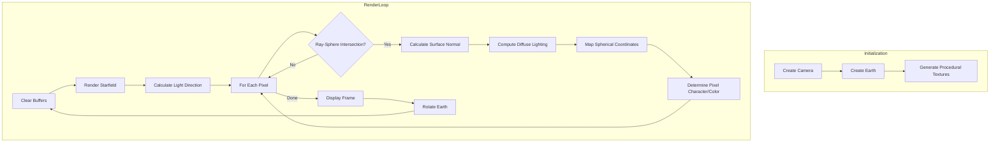
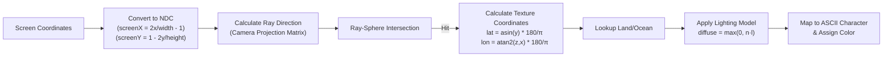
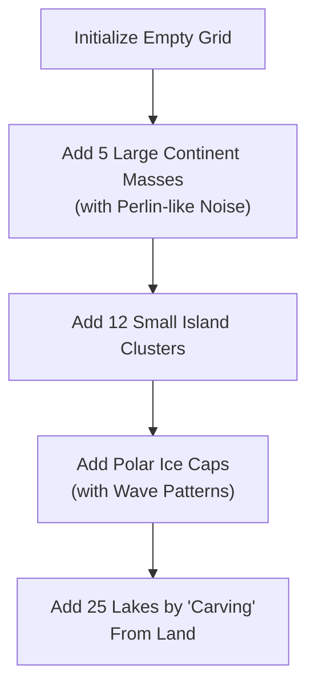
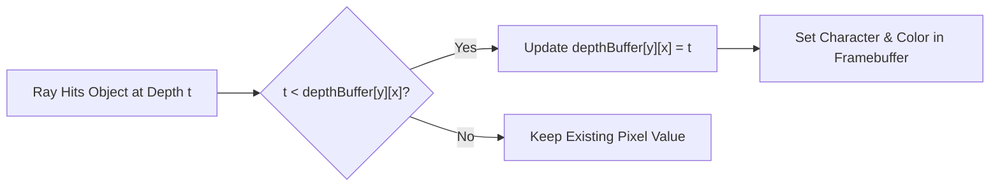
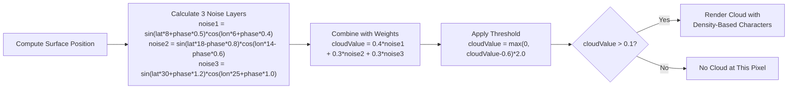
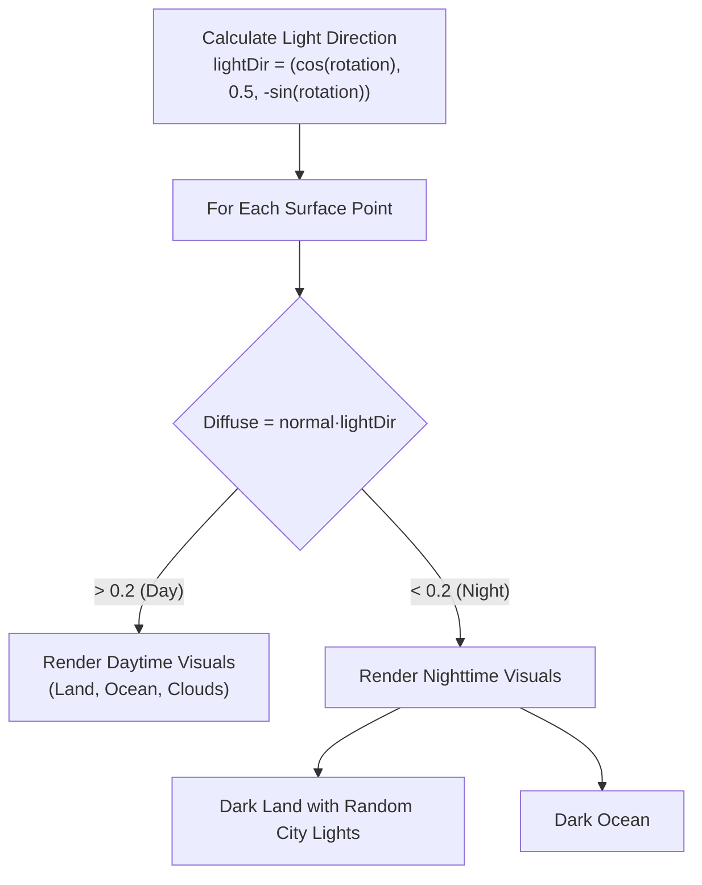

# Hello World (3D ASCII)

A 3D renderer that makes a rotating Earth using ASCII characters for terminal display. Complete with procedural continents, clouds, day/night cycles, and city lights!!!!

## Mathematical Foundation

### 1. Vector Mathematics

#### Vector Operations
The program uses 3D vectors (`Vec3`) as its fundamental data structure, implementing:

- Vector addition: `v₁ + v₂ = (x₁+x₂, y₁+y₂, z₁+z₂)`
- Vector subtraction: `v₁ - v₂ = (x₁-x₂, y₁-y₂, z₁-z₂)`
- Scalar multiplication: `v × s = (x×s, y×s, z×s)`
- Dot product: `v₁ · v₂ = x₁×x₂ + y₁×y₂ + z₁×z₂`
- Length calculation: `|v| = √(x² + y² + z²)`
- Normalization: `v̂ = v/|v|`
- Cross product: `v₁ × v₂ = (y₁×z₂-z₁×y₂, z₁×x₂-x₁×z₂, x₁×y₂-y₁×x₂)`

### 2. Rotation Mathematics

#### Rodrigues' Rotation Formula
For rotating vectors around an arbitrary axis:

```
v_rot = v * cos(θ) + (axis × v) * sin(θ) + axis * (axis · v) * (1 - cos(θ))
```

Implemented as a rotation matrix:
```
R = [
    [c + k*ax²,       k*ax*ay - s*az,   k*ax*az + s*ay],
    [k*ay*ax + s*az,  c + k*ay²,        k*ay*az - s*ax],
    [k*az*ax - s*ay,  k*az*ay + s*ax,   c + k*az²]
]
```
where:
- c = cos(θ)
- s = sin(θ)
- k = 1 - cos(θ)
- ax, ay, az = normalized axis components

### 3. Ray-Sphere Intersection

The formula for ray-sphere intersection is:
```
(o + td - c)² = r²
```
where:
- o = ray origin
- d = ray direction
- t = distance along ray
- c = sphere center
- r = sphere radius

Expanded to the quadratic form:
```
at² + bt + c = 0
```
where:
- a = d · d
- b = 2(o - c) · d
- c = (o - c)² - r²

Solutions:
```
t = (-b ± √(b² - 4ac)) / 2a
```

### 4. Perspective Projection

The camera uses:
- Field of view (FOV) angle to determine viewing frustum
- Aspect ratio for width/height correction
- View matrix constructed from position, lookAt, and up vectors

Screen-to-world ray direction:
```
direction = forward + right × (screenX × widthAtDist1) + trueUp × (screenY × heightAtDist1)
```
where:
- widthAtDist1 = 2 × tan(fovRadians/2) × aspectRatio
- heightAtDist1 = 2 × tan(fovRadians/2)

### 5. Cartesian to Spherical Coordinate Conversion

To map textures onto the sphere:
```
latitude = asin(y) × 180/π
longitude = atan2(z, x) × 180/π
```

### 6. Lighting Model

A Lambertian diffuse lighting model:
```
diffuse = max(0, normal · lightDirection)
```

### 7. Procedural Generation

#### Continental Shapes
Uses combinations of sine and cosine functions with randomized parameters:
```
noise = 0.3 × sin(lat × 0.1) × cos(lon × 0.1) +
        0.2 × sin(lat × 0.2 + 0.5) × cos(lon × 0.2 + 0.3) +
        0.1 × sin(lat × 0.4 + 1.0) × cos(lon × 0.4 + 0.7)
```

#### Cloud Patterns
Multi-layer noise function:
```
noise1 = sin(lat × 8.0 + cloudPhase × 0.5) × cos(lon × 6.0 + cloudPhase × 0.4)
noise2 = sin(lat × 18.0 - cloudPhase × 0.8) × cos(lon × 14.0 - cloudPhase × 0.6)
noise3 = sin(lat × 30.0 + cloudPhase × 1.2) × cos(lon × 25.0 + cloudPhase × 1.0)
cloudValue = 0.4 × noise1 + 0.3 × noise2 + 0.3 × noise3
```

## Build Instructions

### Prerequisites

- C++ compiler with C++11 support
- Standard library with threading support

### Building on Linux

```bash
# From the build directory
g++ -std=c++11 -o hello_world ../hello_world.cpp
```

### Building on macOS

```bash
# From the build directory
clang++ -std=c++11 -o hello_world ../hello_world.cpp
```

### Building on Windows

#### Using MinGW

```bash
# From the build directory
g++ -std=c++11 -o hello_world.exe ../hello_world.cpp
```

#### Using Visual Studio

```bash
# From the build directory
cl /EHsc /O2 /std:c++11 ../hello_world.cpp /link /OUT:hello_world.exe
```

Or open a new Visual Studio project and add the ascii_earth.cpp file to it.

### Running the Application

After building, run the executable:

- Linux/macOS: `./hello_world`
- Windows: `hello_world.exe`

You may need to maximize your terminal window for the best viewing experience.

## Rendering Pipeline



## Screen Mapping Process



## Earth Texture Generation



## Depth Buffering Process



## Cloud Generation Process



## Day/Night Cycle Implementation



## License

MIT License, do what ya want with it! Give me credit, dont give me credit, dont care, just have fun with it!